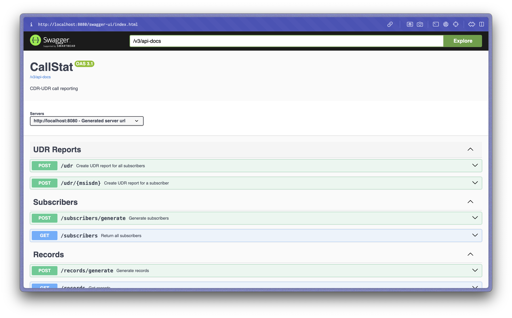

# CallStat

Restful API для создания CDR и UDR отчетов.

### Содержание

* [Задание](#задание)
  * [Дано](#дано)
  * [Задача 1](#задача-1)
  * [Задача 2](#задача-2)
  * [Задача 3](#задача-3-дополнительная)
  * [Общие условия](#общие-условия)
  * [Критерии](#критерии)
  * [Глоссарий](#глоссарий)
* [Решение](#решение)
  * [Архитектура](#архитектура)
  * [Генерация записей](#генерация-записей)
  * [Получение UDR отчета](#получение-udr-отчета)
  * [Запуск проекта](#запуск-проекта)
  * [Доступные эндпоинты](#доступные-эндпоинты)
* [Заключение](#заключение)

# Задание

## Дано:

Все звонки, совершенные абонентом сотового оператора, собираются на коммутаторах и фиксируются в CDR формате. Когда абонент находится в роуминге за процесс сбора его данных отвечает обслуживающая сеть абонента. Для стандартизации данных между разными операторами, международная ассоциация GSMA ввела стандарт BCE. Согласно ему, данные с CDR должны агрегировать в единый отчет UDR, который впоследствии передается оператору, обслуживающему абонента в домашней сети. На основе этого отчета, домашний оператор выставляет абоненту счет.

Цель задания – смоделировать описанный процесс в упрощенном виде.

Целевой микросервис будет генерировать CDR записи, сохранять их в базу данных и предоставлять Rest-API для получения UDR отчетов и генерации сводного отчета с CDR записями по абоненту.

CDR-запись включает в себя следующие данные:

* тип вызова (01 - исходящие, 02 - входящие);
* номер абонента, инициирующего звонок;
* номер абонента, принимающего звонок;
* дата и время начала звонка (ISO 8601);
* дата и время окончания звонка (ISO 8601);

CDR-отчет представляет из себя набор CDR-записей.

* разделитель данных – запятая;
* разделитель записей – перенос строки;
* данные обязательно формируются в хронологическом порядке;
* в рамках задания CDR-отчет может быть обычным txt/csv;

Вот пример фрагмента CDR-отчета:

```csv
02, 79876543221, 79123456789, 2025-02-10T14:56:12, 2025-02-10T14:58:20
01, 79996667755, 79876543221, 2025-02-10T10:12:25, 2025-02-10T10:12:57
```

UDR представляет из себя объект в формате JSON, который включает в себя номер абонента и сумму длительности его звонков.

Пример UDR объекта:

```json
{
    "msisdn": "79992221122",
    "incomingCall": {
        "totalTime": "02:12:13"
    },
    "outcomingCall": {
        "totalTime": "00:02:50"
    }
}
```

## Задача 1:

Напишите часть, эмулирующую работу коммутатора, т.е. генерирующую CDR записи.

### Условия:

1. [x] Во время генерации создаются CDR записи и сохраняются в локальную БД (h2);
2. [x] Данные генерируются в хронологическом порядке звонков, т.е. записи по одному абоненту могут прерываться записями по другому абоненту;
3. [x] Количество и длительность звонков определяется случайным образом;
4. [x] Установленный список абонентов (не менее 10) хранится в локальной БД (h2);
5. [x] Один прогон генерации создает записи сразу за 1 год.

## Задача 2:

Напишите часть, предоставляющую Rest-API для работы с UDR.

### Условия:

1. [x] Требуется REST метод, который возвращает UDR запись (формат предоставлен выше) по одному переданному абоненту. В зависимости от переданных в метод параметров, UDR должен составляться либо за запрошенный месяц, либо за весь тарифицируемый период.
2. [x] Требуется REST метод, который возвращает UDR записи по всем нашим абонентам за запрошенный месяц.
3. [x] Данные можно брать только из БД.

## Задача 3 (дополнительная):

Напишите часть, формирующую и сохраняющую CDR-отчет.

### Условия:

1. [x] Напишите, REST метод, который инициирует генерацию CDR-отчета и возвращает успешный ответ (или текст ошибки) + уникальный UUID запроса, когда файл будет готов.
2. [x] CDR файл должен генерироваться для запрошенного абонента за переданный период времени. Переданный период может не совпадать с календарными месяцами. Например, можно запросить отчет по звонкам за две недели или за полгода.
3. [x] Данные можно брать только из БД.
4. [x] Сгенерированный файл может быть в формате csv или txt и располагаться в рабочей папке сервиса, в директории /reports.
5. [x] Название файла должно содержать номер пользователя и уникальный UUID запроса. Например – «79991112233_ 61f0c404-5cb3-11e7-907b-a6006ad3dba0.csv»

## Общие условия:

1. [x] В репозитории разместить Readme описание задания и вашего решения. Дополнительно описать шаги для запуска Application (если есть какие-то нюансы) и эндпоинты rest методов.
2. [x] Конечное решение должно быть оформлено в виде одного микросервиса на Spring Boot.
3. [x] Допустимо использовать фреймворк Spring и любые его модули;
4. [x] Допустимо использовать сторонние библиотеки (с обоснованием);
5. [x] В рамках задания не требуется упаковывать решение в Docker. Сервис должен запускаться локально, силами Spring Boot. Эндпоинты rest методов тоже должны быть локальные.
6. [x] Код должен быть покрыт тестами; Покрытие более чем на 75% будет плюсом;
7. [x] Рекомендуется использовать H2. (Другие БД – минус баллы).
8. [x] Ваш SpringBootApplication должен успешно запускаться, а Rest-Api должно отвечать;
9. [x] К ключевым классам добавить javadoc описание;
10. [ ] Конечное решение размещаете на репозитории в github в виде проекта и jar файла с зависимостями;

## Критерии:

* знание Java core актуальной версии;
* умение работать с инструментарием экосистемы Java;
* умение работать с БД;
* грамотно составленная архитектура решения;
* умение описывать выбранный подход;
* «чистота» кода;
* оптимальность при работе с ресурсами;
* работоспособность решения;
* гибкость и расширяемость.

## Глоссарий:

* _CDR – Call Data Record – формат файла, содержащего в себе информацию о действиях, совершенных абонентом за тарифицируемый период._
* _BCE – Billing and Charging Evolution – стандарт обмена роуминговыми данными._
* _UDR – Usage Data Report – Отчет об использовании данных;_
* _msisdn – Mobile Subscriber Integrated Services Digital Number – номер мобильного абонента цифровой сети._

# Решение

Проект реализует микросервис на основе Java Spring Boot, который предоставляет Restful API для генерации и обработки CDR (Call Data Record) и UDR (Usage Data Report) отчетов. Микросервис состоит из нескольких ключевых компонентов, каждый из которых отвечает за свою часть функциональности.

Дополнительная Swagger документация доступна по `/docs`.



## Архитектура:

Проект использует архитектурный паттерн MVC для разделения логики приложения на взаимосвязанные компоненты. Отдельных View-классов нет, за отображение JSON отвечают Controller'ы, возвращающие данные напрямую из моделей, что упрощает логику ручек. Для хранения записей об абонентах и звонках используется in-memory база данных H2.

### Структура проекта

```
com.github.temasaur.callstat/
├─ config/
├─ controllers/
├─ models/
├─ repository/
├─ services/
├─ types/
└─ utils/
```

Для Контроллеров и Моделей есть пакеты `.controllers` и `.models` соответственно. В пакете `.config` находятся конфигурационные классы. В пакете `.repository` определяются репозитории для взаимодействия с базой данных H2 как `CrudRepository`. `.types` хранит переиспользуемые классы особых типов. В пакете `.utils` находятся дополнительные классы-утилиты.

Пакет `.services` хранит сервисы с бизнес-логикой. В подпакетах по четыре файла: интерфейс для определения способа взамодействия с сервисом, абстрактный класс для вынесения общей логики однотипных сервисов, `MockService` класс, хранящий данные в списке, и `ImplService` класс, коммуницирующий с базой данных.

## Генерация записей:

Для генерации записей сначала создаются случайные msisdn номера абонентов (`POST /subscribers/generate`). Ручка принимает опциональный JSON параметр `subscriberCount` для определения количества абонентов. Для простоты реализации номера создаются по логике шаблону `79\d{9}`. 

Далее эмулируется работа коммутатора с помощью создания случайных вызовов в хронологическом порядке с момента год ранее до нынешнего времени (`POST /records/generate`). Возможно ограничить количество записей с помощью опционального JSON параметра `maxRecordCount`. Вся логика генерации находится в `com.github.temasaur.callstat.utils`.

## Получение UDR отчета:

Для получения UDR отчета по одному абоненту используется ручка `POST /udr/{msisdn}` (msisdn - обязательный path parameter). Она также принимает опциональный параметр `month` в JSON для выбора месяца отчета. Если временной промежуток не указан, возвращается отчет по всем записям абонента.

Отдельно выделен эндпоинт `POST /udr`. Он работает по тому же принципу, что и `POST /udr/{msisdn}`, но возвращает отчет по всем пользователям. Данные приходят в виде массива объектов UDR, поэтому, чтобы упростить _работу с API_, его метод отделен.

## Получение CDR отчета:

Для получения CDR отчета используется ручка `POST /cdr/start` (msisdn - обязательный JSON параметр). Как и в случае с UDR, она принимает опциональный JSON параметр для выбора промежутка времени, но для удовлетворения требования о гибкости настройки выведены два параметра, startDate, endDate. Здесь временной промежуток обязателен.

После старта создания отчета пользователь получает uuid background task'и, который далее можно использовать в `GET /cdr/status/{uuid}`, для получения статуса процесса создания отчета.

Отчет формируется в формате CSV, где каждая строка представляет одну запись о звонке. Записи отсортированы в хронологическом порядке по времени начала звонка.

## Запуск проекта:

Для запуска необходимо выполнить следующие шаги:

1. Клонировать репозиторий с проектом

    ```bash
    #!/bin/bash
    git clone git@github.com:Temasaur/CallStat.git
    cd CallStat
    ```

2. Собрать проект с помощью Maven

    ```bash
    #!/bin/bash
    mvn clean install
    ```

3. Запустить приложение

    ```bash
    #!/bin/bash
    mvn spring-boot:run
    ```

4. После успешного запуска, API будет доступен по адресу `http://localhost:8080`

## Доступные эндпоинты:

Список эндпоинтов доступен в автодокументации Swagger по `http://localhost:8080/docs`. Ниже копия доступных ручек:

* `POST /subscribers/generate` – генерация абонентов
  * `subscriberCount` – опциональный JSON параметр количества генерируемых абонентов

* `GET  /subscribers` – получение списка абонентов

* `POST /records/generate` – генерация записей о звонках
  * `maxRecordCount` – опциональный JSON параметр количества генерируемых записей

* `GET  /records` – получение списка записей о звонках

* `POST /udr/{msisdn}` – получение UDR отчета по абоненту
  * `msisdn` - обязательный Path параметр для указания номера абонента
  * `month` – опциональный JSON параметр для выбора месяца отчета

* `POST /udr` – получение UDR отчетов по всем абонентам
  * `month` – опциональный JSON параметр для выбора месяца отчета

* `POST /cdr/start` – запуск генерации CDR отчета
  * `msisdn` – обязательный JSON параметр с номером абонента
  * `startDate` – обязательный JSON параметр начала периода
  * `endDate` – обязательный JSON параметр конца периода

* `GET /cdr/status/{uuid}` – получение статуса генерации CDR отчета
  * `uuid` – идентификатор задачи генерации отчета

# Заключение

Данное решение демонстрирует умение работать с Java, Spring Boot и базами данных, а также способность разрабатывать чистый и поддерживаемый код. Микросервис спроектирован с учетом гибкости и расширяемости, что позволяет в дальнейшем добавлять новые функции и улучшения.
